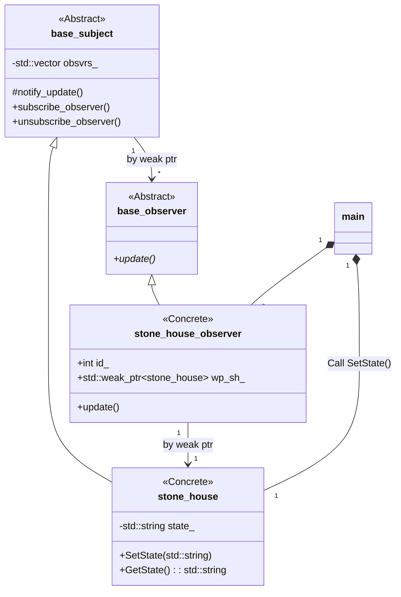
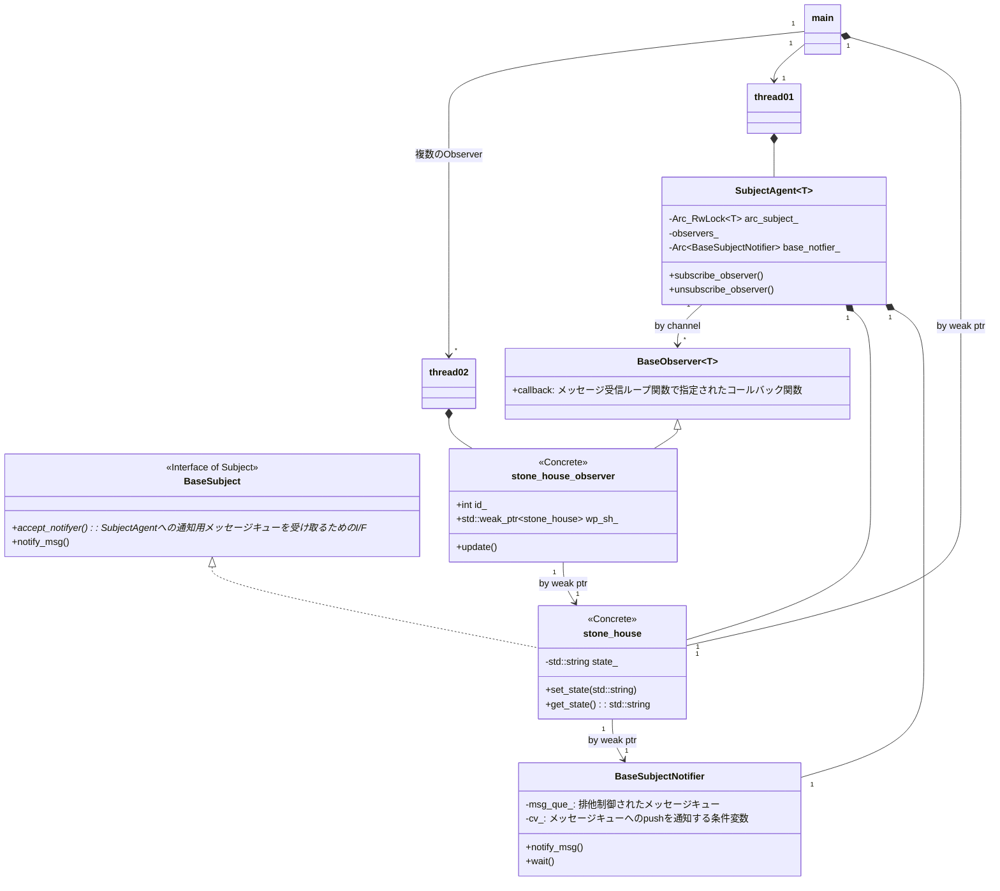

# Design Pattern Implementation Catalog
 This is Design Pattern Implementation Catalog and my understanding and opinion for use
 
## Abstract Factory
### Classification: Creation
* C++ での実装: CreationPattern01_AbstractFactory/cpp_src
* Rust での実装: CreationPattern01_AbstractFactory/rust_src

これらの実装は、Abstract Factoryの典型的なサンプル構成を実装したものになる。

このパターンを実コードで適用し、再利用性のあるコードとして活用するには、

* 具象クラスの実装コードのビルド方法
* 具象クラスのインスタン生成方法
* 具象クラスのインスタンスへアクセス方法

に対する設計がさらに必要となる。
具象クラスの実装が、実装するコード内で完結している場合はこの点はあまり気にする必要がない。必要であったとしても、実装作業の手の内にあるので、どうにでもなる。

問題は、具象クラスが依存するシステムがビルドシステム内に存在しない場合である。

さらに、Abstract Factoryパターンを適用する動機から考えると、具象クラスの実装は他のシステムに依存する場合がほとんどであり、具象クラスが依存するシステムがビルドシステム内に存在しないことは普通に起きることと思われる。

例えば、システムコールを使用するオブジェクトに対しAbstract Factoryを適用する場合、Windows用とLinux用、Mac用それぞれのオブジェクトは、それぞれのシステムでしかビルドできない。

#### 具象クラスの実装コードのビルド方法
よって、具象クラスの実装コードのビルド方法に対しては、下記の実装が必要となる。

* 実装として、Abstract Factoryパターンを適用する。
* さらに具象クラスは、それぞれのビルドシステム(例えばMakefileで切り替える等)でのみビルドされるようにする。

#### 具象クラスのインスタン生成方法
同様に、(Abstract Productクラスではなく)Abstract Factoryクラスの具象クラスのインスタンを生成するコードも
具象クラスの定義を参照するため、ビルド方法と同様に下記の対応が必要になる。

* 具象クラスのインスタンを生成するコードは、それぞれのビルドシステム(例えばMakefileで切り替える等)でのみビルドされるようにする。

#### 具象クラスのインスタンスへアクセス方法
上記までで、ようやくAbstract Factoryの具象クラスのインスタンスオブジェクトが生成できた。
このAbstract Factoryの具象クラスをAbstract Factoryの抽象クラスへの参照に変換すると、
ようやくAbstract Factoryパターンにおけるクライアントコードがアクセス可能となる。
よって、

* Abstract Factoryの具象クラスのインスタンへの参照を、Abstract Factoryの抽象クラスへの参照に変換する実装までを、それぞれのビルドシステム(例えばMakefileで切り替える等)でのみビルドされるようにする。

とする必要がある。
ここまで実装とビルドシステムで考慮することで、ようやくAbstract Factoryパターンの実用的に使用することができる。

意外と、、、重たいですね。
感覚的には、同時期に複数プラットフォームをサポートしたり、ある程度長い期間（３～４年、あるいはそれ以上）コードを流用して継続的に成長させるソフトの場合は、最初から考慮に入れていても価値があると感じます。
いかがでしょうか？　でも意外とそういったソフト、ありませんか？

CreationPattern01_AbstractFactory_Practical は、CreationPattern01_AbstractFactoryに対し、straw_housemaker、wood_housemaker、stone_housemakerがそれぞれ異なるシステムに依存する場合を想定して、仕立て直したものです。

主な変更点は、以下です。

* abstract_house_productの具象クラスの生成I/Fを追加し、クライアントコードからは隠蔽
* 再利用対象となるクライアントコードと、Abstract Factoryの具象クラスの実装コードを意図がわかりやすいように別フォルダに分離。

#### 抽象化の粒度
Windowシステムが用意する部品レベル（ボタンやリストボックス等）でAbstract FactoryパターンのAbstract Productを定義するサンプルを見かけます。
実際にこのレベルで抽象したソフト運用するのは困難ではないかと感じます。
対象とするシステムに対する細かな違いを把握し、互換性がない違いを吸収するのが大変になるからです。
このような場合、品質を維持するために、優秀な人材を確保するだけなく、確保した人材を長期間、同一のソフトに対して充てる必要があります。
しかしながら、優秀な人材はそうたくさんいません。こうなってしまうと担当を入れ替えるのが難しく、担当した人も新しいことに挑戦する機会がなくなり不幸です。
折角の再利用性を高めるためのデザインパターンの適用も、重いばかりです。
結果として負のメンテナンススパイラルに陥ってしまいます。

では、どれぐらいの粒度が良いでしょうか？

これは、個人的な見解ですが、MVCモデルの、V単位ぐらいの大きな粒度でAbstract Productの具象クラスを定義しても良いぐらいではないかと思います（もちろんその中間ぐらいでもよい）。
このぐらいのレベルだと具象クラス内の実装の自由度が高く、具象クラスが対象とするシステムに集中して開発できます。
もちろん、Abstract Factoryパターンで、複数のシステムをサポートしているという設計の理解は必要です。
とはいえ、依存するシステムの入れ替わりとともに人を入れ替えることも可能になるのではないでしょうか。

## Builder
### Classification: Creation
* C++ での実装: CreationPattern02_Builder/cpp_src

Builder Patternは、あまり使用したことがありません。
パターンの意図としては、オブジェクトの構築I/Fと、実際に構築されるデータを分離し、構築するデータの構造を変更しやすくするデザインパターンです。

例えば、データをシリアライズ化するフォーマットを、特定のバイナリ形式のフォーマットにしたり、あるいはテキストデータのJSON形式にしたりというように、
可換にする必要がある場合に適用できるデザインパターンです。

## Factory Method
### Classification: Creation
* C++ での実装: CreationPattern03_FactoryMethod/cpp_src
* C++ での実装(ラムダ式方式): CreationPattern03_FactoryMethod/cpp_src2
* Rust での実装: CreationPattern03_FactoryMethod/rust_src

これらの実装は、Factory Methodパターンのサンプル実装です。

CreationPattern03_FactoryMethod/cpp_srcは、デザインパターン本でもともと紹介されていた構成をそのまま実装適用したコードです。

一方で、CreationPattern03_FactoryMethod/cpp_src2やCreationPattern03_FactoryMethod/rust_srcは、ラムダ式やクロージャを使用した実装コードです。
こちらの場合、デザインパターン本の実装方式で課題になりやすい、Creatorのサブクラス化が不要になります。
ラムダ式やクロージャの場合、サブクラス化で実現している具象クラスが保持するメンバ変数やデータをキャプチャによって補っている形ですね。
こちらの実装の方が現代的と思われます。

#### クロージャの型について
https://qiita.com/terakoya76/items/f9e2b0bda491aff19b6f

## Prototype
### Classification: Creation
* C++ での実装: CreationPattern04_Prototype/cpp_src

Prototypeパターンは使ったことがないので、コメントが難しいです。
多くのオブジェクトを動的に生成する場合や、ユーザーが定義したプロトタイプオブジェクトを複製する場合に適用しやすいようです。

## Singleton
### Classification: Creation
* C++ での実装(基本): CreationPattern05_Singleton/cpp_src
* C++ での実装(shared_ptrによる実装): CreationPattern05_Singleton/cpp_src2
* C++ での実装(外部情報に従って生成するSingletonを決定する実装例): CreationPattern05_Singleton/cpp_src3
* C++ での実装(cpp_src3に加え、外部情報が決定されるまでSingletonの生成を待機させる実装例): CreationPattern05_Singleton/cpp_src4
* C++ での実装(DLCによる実装): CreationPattern05_Singleton/cpp_srcX
* Rust での実装(lazy_staticによる実装例): CreationPattern05_Singleton/rust_src
* Rust での実装(once_cellによる実装例): CreationPattern05_Singleton/rust_src2

Singletonパターンの今どきの実装です。

Singletonの良い点は、システム上1つしかないリソースへのアクセスを1つのオブジェクトで対応させることを保証できる点です。
（n個という有限個に制限する場合であっても、get_instance()の引数でインスタンスを指定する実装で対応できます）

組込みシステムの場合は、ハードリソースは有限個となる場合が多いでしょうから、インスタンス数に制約をかけられる点がなかなかに有用だと思います。
ほかにもグローバル変数とは異なり、アクセス方法を制限できます。そのため、安全な実装を作りやすい点も良い点です。
また、グローバルにアクセス可能なリソースでありながら、遅延初期化を実現できる点も、隠れたメリットだと思います。

なお、DLCによる実装は、今どき（C++11以降）の実装ではあまり使用しないと思います。

Rustは、ほぼ写経です。( ﾟДﾟ)

## Adapter
### Classification: Structure
* C++ での実装(コンポジットタイプ): StructurePattern01_Adapter\cpp_src
* C++ での実装(多重継承タイプ): StructurePattern01_Adapter\cpp_src2
* Rust での実装: StructurePattern01_Adapter\rust_src

これらの実装は、Apdaterパターンのサンプル実装で、I/Fを適合させる目的でAdapterパターンを使用したサンプルです。

C++での実装では、コンポジットタイプの実装の形は定石で、Adapteeクラスへのポインタを保持します。
一方で、Rustの実装では、トレイトを追加実装する形としました。これは、C++では多重継承タイプに相当する実装方式と考えられます。

Adapterパターンの大事なポイントは、既存のクラスには手を加えることなく、I/Fを揃えることが出来る点ですね。

### 補足
もしAdapteeクラスがFactory系の場合は、実質的にFactory Methodパターンになります。この場合、生成されるオブジェクトにもAdapterを適用する必要があるでしょう。

## Bridge
### Classification: Structure
* C++ での実装: StructurePattern02_Bridge/cpp_src

クラスとその派生クラスの実装を（主に動的に）切り替える場合に適用する候補となるパターンです。
継承を使った抽象化と実装の分離では、その関係が静的に結びついてしまします。
Bridgeパターンは、実実装のクラスを分離し、インスタンスへのポインタを保持することで、動的な結びつきに変更します。

Adapterパターンと似ていますが、適用する状況とその意図によって、異なるパターンとなります。
Adapterパターンは、既存のクラスと無関係のクラスを結びつけるため、後付けで適用されるパターンです。
一方、Bridgeパターンは、抽象化されたクラスとその実装を設計時に分離し、またそれらを結び付けるのも設計時に行われような場合に、適用されるパターンです。

## Composite
### Classification: Structure
* C++ での実装(共通的操作を仮想メンバ関数による実装例): StructurePattern03_Composite\cpp_src
* C++ での実装(共通的操作をVisitorパターンで実装した例): StructurePattern03_Composite\cpp_src2
* C++ での実装(共通的操作をVisitorパターンとdynamic_castで実装した例): StructurePattern03_Composite\cpp_src3
* Rust での実装: StructurePattern03_Composite\rust_src
* Rust での実装(子のインスタンス群のスキャンをIteratorトレイトで対応): StructurePattern03_Composite\rust_src2

みんな大好き、木構造のCompositeパターンです。

Compositeパターンの悩ましい点は、具象化クラスの個別I/Fに対する共通化の是非ですね。どうしてもトレードオフが発生するところです。
サンプルコードでは、ベースとなるクラスで派生クラスの個別I/Fの実装を行わずにComposite構造をスキャンできるように、
Visitorパターンを使ったサンプルとしました。

StructurePattern03_Composite\cpp_src3は、ベースクラスから派生クラスの詳細を分離する
ような場合（フレームワークや何らかのライブラリの実装等）に適用できる方法の一つと思います。

StructurePattern03_Composite\rust_srcは、CompositeのI/Fをトレイトで実装した定石的な実装です。

StructurePattern03_Composite\rust_src2は、上記に加えて子のインスタンス群のスキャンをIteratorで実現することで、
子を保持するコレクションに依存しないようしました。
この際、コレクションの生存期間をIteratorオブジェクトの生存期間と同じにする必要があり、lifetimeの情報を追加しています。

## Decorator
### Classification: Structure
* C++ での実装: StructurePattern04_Decorator\cpp_src
* Rust での実装: StructurePattern04_Decorator\rust_src

既存の機能に、新たな責務を追加するパターンですね。
Adapterパターンは、I/Fを変更することを目的としたパターンですが、Decoratorパターンは、機能、責務の追加を目的としたパターンです。
その上で、オブジェクトを使う側は、Decoratorの有無を考慮しなくてよい構造です。
また、Decoratorを複数付加することも可能です。

StructurePattern04_Decorator\rust_srcは、DecoratorのI/Fをトレイトで実装した定石的な実装です。

## Facade
### Classification: Structure
* C++ での実装: StructurePattern05_Facade/cpp_src

Bridgeパターンでは、子豚3兄弟のそれぞれの家とそれにまつわるストーリーを別々のクラスとして実装しました。
その結果、3つのクラスとそれぞれで呼び出すI/Fがそれぞれに定義されることとなりました。
Facadeパターンでは、Facadeクラスがそれらのクラス群に対するI/Fとして定義され、このような複数のクラスで
構成されるような実装の詳細をFacadeクラスの後ろに隠すことで、ソフトウェアレイヤー間の結合度を下げるよう
なデザインパターンです。

このサンプルでは、Bridgeパターンのメイン関数で行っていたオブジェクトの管理などをFacadeクラスの後ろに隠し、
クラス構成等の実装の詳細をクライアント側から切り離しています。

[補足]
Facadeパターンはそのパターンの目的から、Singletonパターンを併用する場合も多いですが、このサンプルでは、
Singletonパターンは適用していません。
代わりに、pimplイディオムで実装の詳細を隠しています。

## Chain of Responsibility
### Classification: Behavior
* C++ での実装: BehaviorPattern01_ChainOfResponsibility\cpp_src

要求を処理する可能性のあるオブジェクトを数珠繋ぎにして、要求を処理するパターンです。

要求を処理する事ができるオブジェクトが複数存在し、また処理するオブジェクトが動的に変化する場合に適用できるパターンですね。

このパターンは、要求を発行する側と、要求を処理する側が１対多のような場合に適用される場合が多いと思います。
特に、要求を処理する側は自身のオブジェクトの観点のみから、ここの要求処理の要否、および実装内容を考えることができるため、
オブジェクト間の結合度を低くできます。

## Observer
### Classification: Behavior
* C++ での実装: BehaviorPattern07_Observer\cpp_src
* Rust での実装: BehaviorPattern07_Observer\rust_src
* Rust での実装(メッセージによる実装): BehaviorPattern07_Observer\rust_src2
* Rust での実装(メッセージ + 非同期タスクによるrust_src2の再実装): BehaviorPattern07_Observer\rust_src3

有名なパターンで、1対多の関係を実現するパターンです。
また、MVCのパターンでも使用される構成です。

このパターンの実装を、コールバックで実現したり、メッセージで実現したりする等、実現方法も様々です。

ちなみにMVCパターンでは、M=subject、V=observerという関係です。
Observerは複数存在可能ですので、Vを複数持てる構成を実現できます。

このパターンの注意点は、Updateの無限連鎖です。

具体的には、
1. subjectクラスがobserverのUpdate()を呼び出す
1. Observerクラスからsubjectクラスの操作
1. (1)に戻る。あるいは、さらに別のクラスを経由して(1)に戻る
という流れです。

observerパターンの実装をライブラリ化して提供する場合、特にこの状況に対策する必要があります。

対策の基本は、Update()の呼び出しに対し、subjectを変更する操作を呼び出さないことです。
本来Observerの役割から、subjectの情報をもらうだけの実装が可能となるはずです。
もし呼び出さなければならない場合は、クラスに持たせた責務の設計に問題がある可能性が高いです。実装ではなく、設計を見直してみましょう。

#### Rustでの実装について
Rustは、共有参照、可変参照についてシビアな言語であるため、Observerパターンのような相互に参照する構造をもつ
デザインパターンは実装が結構大変です。

BehaviorPattern07_Observer\rust_srcでは、更新通知はSubjectのset系APIに含んでいません。
変更操作による可変参照と更新通知後の共有参照で借用の競合が発生するためです。
そのため、set系APIを使用する側がわざわざ更新通知を行っています。

BehaviorPattern07_Observer\rust_src2では、Observerパターンの更新通知をチャンネルを使用したメッセージで実装することで、
直接的な参照をObserverからSubjectに限定し、スレッドを分離することで共有参照、可変参照の課題をRwLockをつかって解決した構成です。

また、更新通知は、SubjectAgentというオブジェクト経由で発行しています。理由は下記の理由によります。

Senderは、Sendトレイトは実装されていますがSyncトレイトが(意図的に)実装されていないません。  
一方で、set系APIは複数のスレッドから呼び出せるため、更新通知をSubjectのset系APIから行う場合、チャンネルのSenderのスレッド間共有が発生します。
このスレッド間共有によってコンパイルエラーになります。
これは、コードの問題ではなく、ソフト構造要因です。

したがって、set系APIからSubjectAgentというオブジェクトを経由して更新通知を行うように、更新通知の機能をSubjectAgentに分離する構造変更を行いました。  
その上で、Subjectのset系APIからSubjectAgentへの通知は、チャンネルではなくMutexとVecDeqを組み合わせた簡単なメッセージキューで実現し、
Senderのスレッド間共有を回避するようにしています。

最終的に、メッセージで能動的に動くオブジェクトで実現することなました。  
これはもう、ObaserverパターンというよりはほぼActive Objectパターンです。う～ん・・・。

というわけで、set系APIからの更新通知を実現するにはやたら手間がかかってしまいました。

BehaviorPattern07_Observer\rust_src3は、BehaviorPattern07_Observer\rust_src2を非同期タスクで書き直したものです。
async-stdで実装していますが、RwLockの非同期タスク対応を使用すためにunstable版で機能実現となっています。
こういった道具不足もあり、rustの非同期タスクを本格的に使用するには、残念ながら今一歩足りない感じです。(2022/10/1時点)

#### クラス図視点での比較
cpp_srcのクラス図は下記で、一般的なObserverパターンの構成です。

サンプルコードの全体の流れとしては、
1. main関数からstone_houseクラスのSetState()を用いて状態を変更。
1. SetState()から、Observerへ更新を知らせるためのObserverのupdate()が呼び出される
1. stone_house_observerのupdate()が呼び出され、stone_houseのGetState()を用いて更新後の状態を入手する

という流れです。

一方で、rust_src2、rust_src3は、SubjectAgentという役割を持つクラスを導入した結果、クラス図は下記のような構成です。

また、サンプルコードの流れは、
1. main()関数から、stone_houseクラスのSetState()を用いて状態を変更。
1. SetState()から、BaseSubjectNotifierへ更新通知メッセージをpush。
1. SubjectAgent\<T\>が、BaseSubjectNotifierへ更新通知メッセージを受信、stone_house_observerへ通知メッセージをチャンネル経由で送信
1. BaseObserver\<T\>が、更新通知メッセージを受信し、コールバック関数を呼び出す。
1. コールバック関数から、stone_houseクラスのget_state()を用いて更新後の状態を入手する

という流れです。

## Strategy
### Classification: Behavior
* C++ での実装(Strategyを隠蔽する実装): BehaviorPattern09_Strategy\cpp_src
* C++ での実装(Strategyを利用者側が提供する実装): BehaviorPattern09_Strategy\cpp_src2
* C++ での実装(Strategyを利用者側がlambda関数で提供する実装): BehaviorPattern09_Strategy\cpp_src3
* Rust での実装(Strategyを隠蔽する実装): BehaviorPattern09_Strategy\rust_src

機能を実現するアルゴリズムを動的に切り替えることを目的としたパターンですね。
機能を実現するアルゴリズムを切り替えるため、アルゴリズムを実行するI/Fが再利用対象となるパターンです。

ConcreteStrategyクラスに状態を持たせないよう、状態に依存する情報はContexクラス側から提供するようにI/Fを設計することが大事です。
そうすることで、動的なアルゴリズムの切り替えが可能になります。

また、cpp_src2の実装例のように、利用者側がConcreteStrategyを提供する場合、Abstract Factoryパターンとの組み合わせて使う状況も考えられるでしょう。

## State
### Classification: Behavior
* C++ での実装(Stateを隠蔽する実装): BehaviorPattern08_State\cpp_src

状態によって、振る舞いを変更する事ができるStateパターンです。

## Template Method
### Classification: Behavior
* C++ での実装: BehaviorPattern10_TemplateMethod\cpp_src
* Rust での実装: BehaviorPattern10_TemplateMethod\rust_src

アルゴリズムの一部をサブクラス側で定義する構成によって、アルゴリズムを再利用対象とするパターンです。
再利用する対象が異なっているため、Strategyパターンとは似て非なるパターンです。

